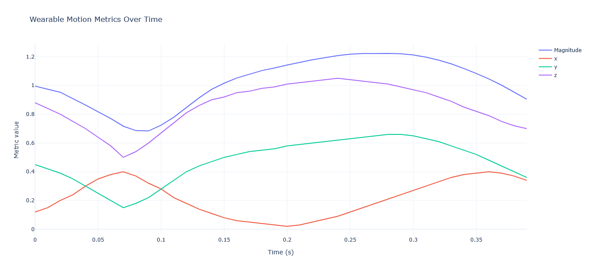
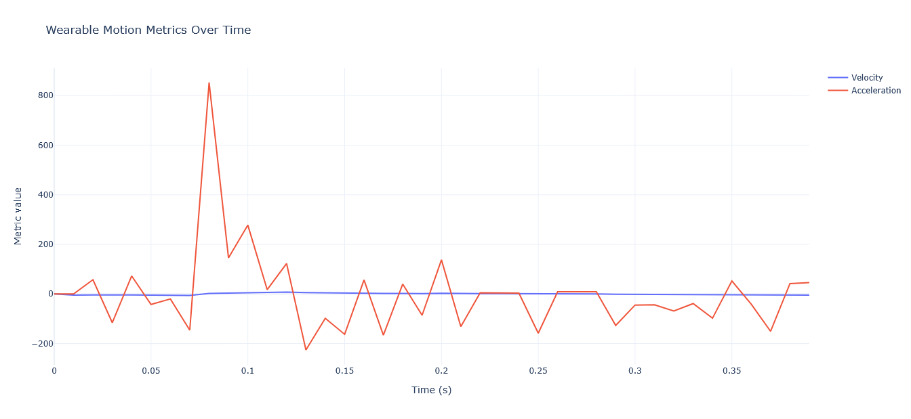
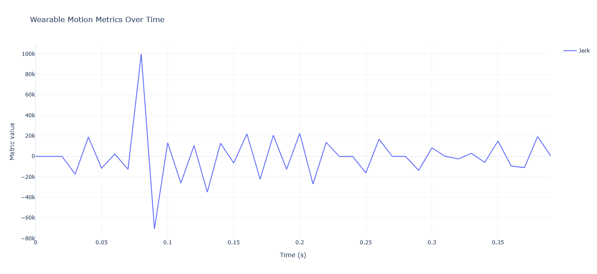
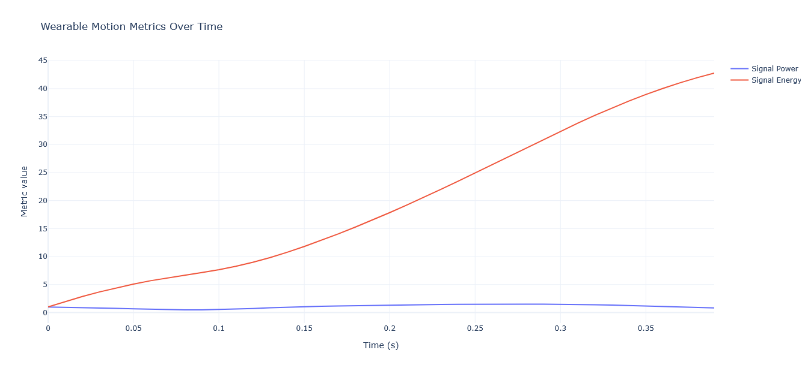

# Wearable Motion Data Analysis

A small engineering project demonstrating how wearable motion sensor data can be processed to extract meaningful movement metrics such as **velocity**, **acceleration**, **jerk**, **signal power**, and **signal energy**.

The project implements a **Python data processing pipeline** and exposes the results through a **FastAPI API** with interactive **Plotly visualizations**.

This repository is designed as a **clean R&D-style demo** showing how raw sensor data can be transformed into interpretable motion features.

---

# Features

## Motion Data Processing Pipeline

The pipeline processes **3-axis accelerometer data** typically collected from wearable sensors such as smartwatches, fitness trackers, or inertial measurement units (IMUs).

Each data sample contains:

- `timestamp` – time of measurement  
- `x`, `y`, `z` – acceleration along the three spatial axes  

The pipeline then performs the following steps:

1. Load motion sensor CSV data
2. Clean and preprocess timestamps
3. Compute motion features:
   - **Magnitude**
   - **Velocity**
   - **Acceleration**
   - **Jerk**
   - **Signal Power**
   - **Signal Energy**
4. Generate interactive visualizations

---

## API Interface

The project exposes a **FastAPI service** allowing users to explore and analyze motion data.

Available endpoints:

GET /health
GET /metrics
GET /data
GET /plot
POST /analyze

---

## CSV Upload Analysis

Users can upload their own wearable motion dataset using:

POST /analyze

The CSV file must contain the following columns:

timestamp,x,y,z

The API will run the full processing pipeline and return summary statistics.

---

# Project Structure

wearable-motion-data-analysis/

├── Makefile
├── README.md
├── Pipfile
├── Pipfile.lock
├── run_pipeline.py
├── requirements.txt
├── .gitignore

├── data/
│ └── sample_motion_data.csv

├── src/
│ ├── __init__.py
│ ├── config.py
│ ├── logger.py
│ ├── load_data.py
│ ├── preprocess.py
│ ├── features.py
│ └── visualize.py

└── app/
│ └──  main.py

└── docs/

---

# Extracted Motion Features

| Feature | Description |
|--------|-------------|
| Magnitude | Overall motion intensity from x/y/z acceleration |
| Velocity | Rate of change of motion magnitude |
| Acceleration | Rate of change of velocity |
| Jerk | Rate of change of acceleration (detects sudden movements) |
| Signal Power | Instant motion intensity |
| Signal Energy | Accumulated motion intensity over time |

---

# Installation

Clone the repository:

git clone https://github.com/loisnel04/wearable-motion-data-analysis.git

cd wearable-motion-data-analysis

Install dependencies using **Pipenv**:

pipenv install

Activate the environment:

pipenv shell

---

# Quick Commands

The project includes a **Makefile** for convenience.

Run the API:

make run-api

Run the pipeline locally:

make run-pipeline

---

# Run the API manually

pipenv run uvicorn app.main:app --reload

Then open the interactive API documentation:

http://127.0.0.1:8000/docs

---

# Example API Endpoints

## Health Check

GET /health

Returns the API status.

---

## Motion Metrics

GET /metrics

Returns summary statistics computed from the dataset.

---

## Processed Motion Data

GET /data

Returns the processed dataset including computed motion features.

---

## Motion Visualizations

GET /plot

Returns Plotly figures for:

- raw motion signals
- motion dynamics
- jerk
- signal intensity

---

## Analyze Uploaded CSV

POST /analyze

Upload a CSV file containing motion sensor data.

Required format:

timestamp,x,y,z

The API will run the processing pipeline and return computed metrics.

---

# Example Dataset

A small synthetic dataset is included:

data/sample_motion_data.csv

The data simulates accelerometer signals sampled at a fixed frequency.

---

## Example Visualizations

The pipeline generates several visualizations to help interpret wearable motion signals and derived movement features.

### Raw Motion Signals

Displays the original accelerometer signals (`x`, `y`, `z`) and the computed **magnitude** of the motion vector.

---

### Motion Dynamics

Shows the first and second derivatives of the motion signal:
- **velocity**
- **acceleration**

These metrics describe how movement evolves over time.

---

### Sudden Motion Detection

Displays the **jerk**, which represents the rate of change of acceleration and helps detect abrupt movements.

---

### Activity Intensity

Shows motion intensity features derived from the signal:

- **signal power**
- **signal energy**

These metrics provide insight into the overall movement intensity.

# Why This Project

This project demonstrates how **wearable sensor data can be transformed into interpretable motion metrics** through a clean engineering pipeline.

The goal is to showcase:

- structured data processing
- signal feature extraction
- visualization
- API exposure

Similar pipelines are commonly used in:

- wearable health devices
- biomechanical analysis
- activity recognition
- rehabilitation monitoring
- movement analysis

---

# Technologies

- Python
- Pandas
- NumPy
- Plotly
- FastAPI
- Uvicorn
- Pipenv

---

# Author

Loïs Isnel  
Software engineer interested in **data processing, AI systems, and health technologies**.

GitHub:  
https://github.com/loisnel04
