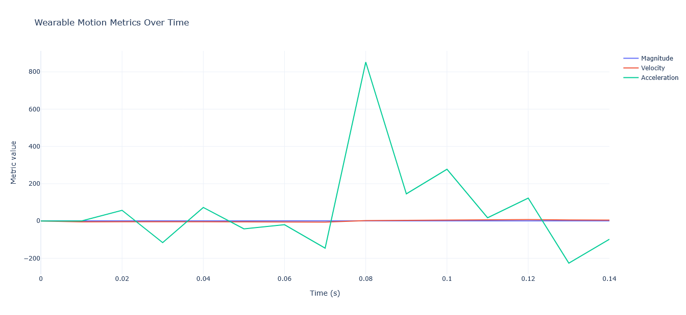

# wearable-motion-data-analysis

A clean Python engineering demo for processing wearable motion sensor data and extracting movement-derived metrics such as magnitude, velocity, and acceleration.

## Project goal

This repository demonstrates how raw wearable sensor measurements can be transformed into interpretable movement insights through a simple and structured data pipeline.

The project is intentionally small in scope and focused on:
- sensor data loading
- preprocessing
- motion feature extraction
- interactive visualization
- API exposure with FastAPI

## Tech stack

- Python
- Pandas
- NumPy
- Plotly
- FastAPI

## Project structure

```bash
wearable-motion-data-analysis/
├── README.md
├── requirements.txt
├── .gitignore
├── data/
│   └── sample_motion_data.csv
├── src/
│   ├── load_data.py
│   ├── preprocess.py
│   ├── features.py
│   └── visualize.py
├── app/
│   └── main.py
└── docs/

## Example visualization


